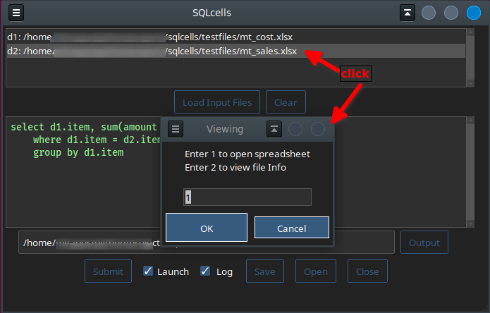

## SQLcells
**Using SQL on Spreadsheets  
A Python Desktop GUI**

### Spreadsheet inputs and result

When _Launch_ is checked, the result is opened in LibreOffice Calc.  
When _Log_ is checked, the input file paths and SQL code is appended to a log file.

There is a limit of seven input tables (files: spreadsheet or csv)

Clicking on an input file lets you open the spreadsheet/csv or view the columns and data types.

The following is an example of a saved query setup file. _sql\_sample.txt_

    d1: /home/x/y/z/projects/sqlcells/testfiles/sampledatainsnames.xlsx
    d2: /home/x/y/z/projects/sqlcells/testfiles/sampledatainsurance.xlsx
    SQL
    select d1.Policy, last_name, first_name, Expiry, State, InsuredValue, email
    	from d1, d2
    	where d1.Policy = d2.Policy
    	order by State, Expiry, last_name
    OUTPUT
    out.xlsx
    LAUNCH

An existing query can be run in an _unattended_ or _batch mode_ by using the saved query setup file
as an argument at startup:

    $ python3 sqlcells.py sql_sample.txt

The Launch and Log options will still apply as they were set when saved.

_For Windows note: xlrd may need to be upgraded_
